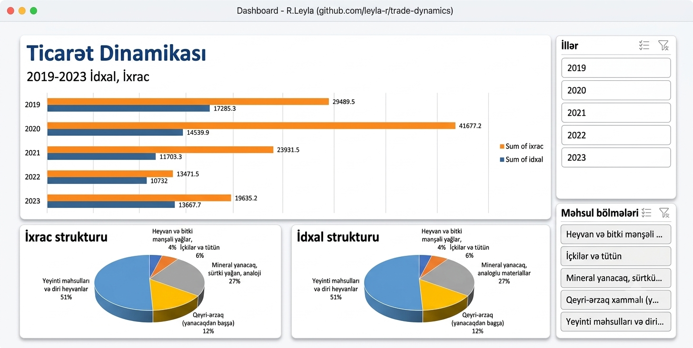

# 📊 Azərbaycan Respublikasının Xarici Ticarət Dinamikası və Strukturu (2019-2023)

Bu layihədə 2019-2023-cü illər üzrə Azərbaycanın idxal və ixrac ticarət dinamikası, həmçinin məhsul bölmələrinə görə xarici ticarət dövriyyəsinin strukturu analiz edilmiş və Excel platformasında interaktiv idarəetmə paneli (**Dashboard**) hazırlanmışdır.

---

## 📈 Dashboard-dan Görünüş
Aşağıdakı şəkildə layihənin vizual və interaktiv idarəetmə paneli əks olunmuşdur:

---

## 🛠️ Layihənin Özəllikləri və Funksionallığı

1. **Dinamik Filtrləmə (Slicers):** 
   - **İllər süzgəci:** 2019-2023-cü illər arasında tək və ya çoxlu seçimlər edərək zaman daxilindəki dəyişikliyi anlıq izləmək mümkündür.
   - **Məhsul bölmələri süzgəci:** Yeyinti məhsulları, içkilər və tütün, mineral yanacaqlar və digər kateqoriyalar üzrə spesifik dataları tək kliklə analiz etmək olar.
   
2. **Vizual Analiz:**
   - **Ticarət Dinamikası (Bar Chart):** İllər üzrə idxal və ixracın həcm müqayisəsini və trendini göstərir.
   - **İxrac və İdxal Strukturu (Pie Charts):** Seçilmiş dövr və məhsul qrupuna əsasən, fərqli bölmələrin ümumi ticarətdəki faiz payını vizuallaşdırır.

3. **Məlumatların Optimizasiyası:**
   - Pivot cədvəllər və qrafiklər arxa fonda təmizlənmiş və yalnız istifadəçi üçün lazımlı vizual təqdimat saxlanılmışdır.

---

## 📂 Repozitoriyanın Strukturu

- `R.Leyla dashboard (1).xlsx` — İnteraktiv idarəetmə panelinin və Pivot cədvəllərin yer aldığı orijinal Excel faylı.
- `Dashboard.png` — Dashboard-un yüksək keyfiyyətli ekran görüntüsü.
- `README.md` — Layihə haqqında bu sənəd.

---

## 🚀 İstifadə Qaydası
1. Repozitoriyadakı `R.Leyla dashboard (1).xlsx` faylını kompüterinizə endirin.
2. Excel faylını açdıqdan sonra yuxarıda görünən **"Enable Content" (Məzmunu Aktivləşdir)** düyməsini sıxın (arxa fondakı data əlaqələrinin işləməsi üçün).
3. Sağ tərəfdəki **İllər** və **Məhsul bölmələri** düymələrindən istifadə edərək paneli interaktiv şəkildə idarə edin.

---
*Hazırladı: Leyla R.*